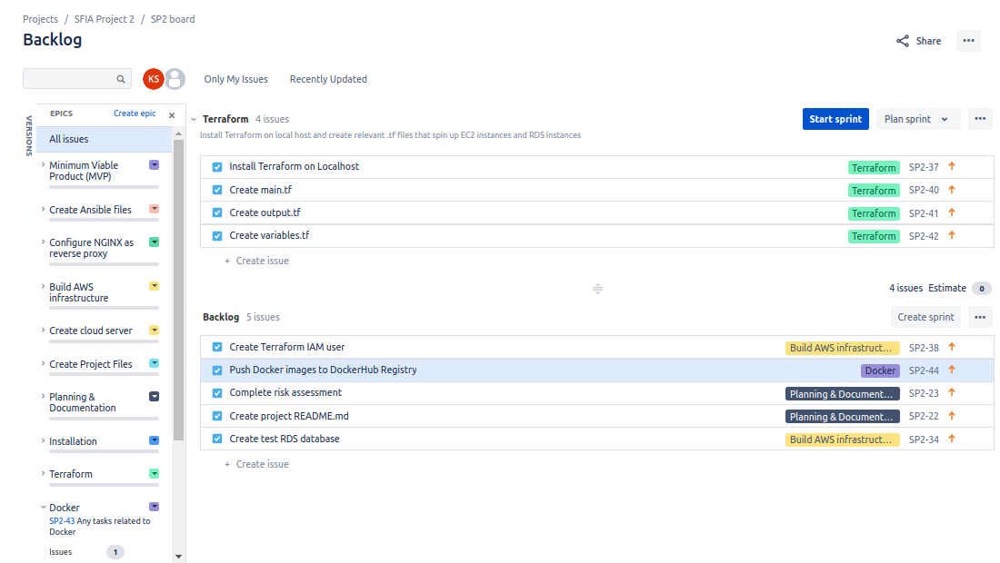
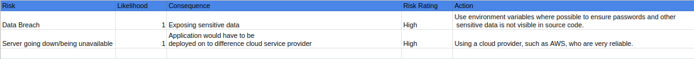
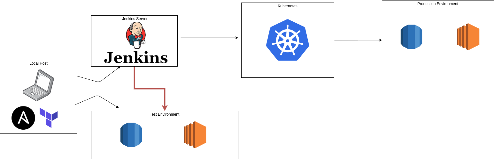

# **Practical Project: SFIA 2nd Assessment**

## **Introduction** 

The aim of this project is to successfully and efficiently deploy a simple Flask application using concepts from training modules, including: 

* Continuous Integration
* Containerisation
* Configuration Management
* Cloud Solutions
* Infrastructure Management
* Orchestration

### Kanban Board
Jira

### *VCS*
Git was used as the Version Control System and GitHub as the host. A repository was used as the central base for the source code. When changes were made to a branch, it would trigger a build in the Jenkins CI server to start a new build and test it. 

### *CI Server*
Jenkins acts as the Continous Integration tool. In the CI pipeline, the Jenkins Controller connects to the test machine via SSH and builds and tests the application. Once these tests have passed, Jenkins SSH's on to the Kubernetes Controller to deploy the application. 

### *Configuration Management*
Ansible is used to install Jenkins on to an AWS EC2 instance. An inventory file, which contains information for the servers needed and their variables is used and a playbook file, which contains instructions on what needs to be configured and on what machine is used. 

### *Cloud Server*
AWS is the cloud provider for this project. Two different AWS services are used in this project; EC2 and RDS. EC2 allows you to easily spin up Virtual Machines and RDS is Amazon's very own Relational Database service. These two cloud services can easily be created via the AWS console or the Command Line Interface. 

### *Containerisation*
Docker and Docker Compose are used as containerisation tools 

### *Reverse Proxy*
NGINX

### Orchestration Tool
Kubernetes

### Infrastructure Management
Terraform

## **Planning**
To help plan this project I used a Scrum board on Jira. Tasks were organised into epics, which were then added to sprints to help me keep focused on the tasks at hand. Below is a screenshot of my backlog. 

## **Risk Assessment**

Below are identified risks; along with their probability and impact. 

## **Infrastructure**

With Ansible and Terraform installed on a local machine, AWS EC2 and RDS instances are provisioned. One EC2 instance is used as the Jenkins Controller and one instance to run tests. One RDS instance will be in the test environment and one in the production environment. Once all stages in the Jenkins pipeline have passed and the test environment has been built correctly, Jenkins builds a Kubernetes cluster so that the application can be deployed on to the production environment. 